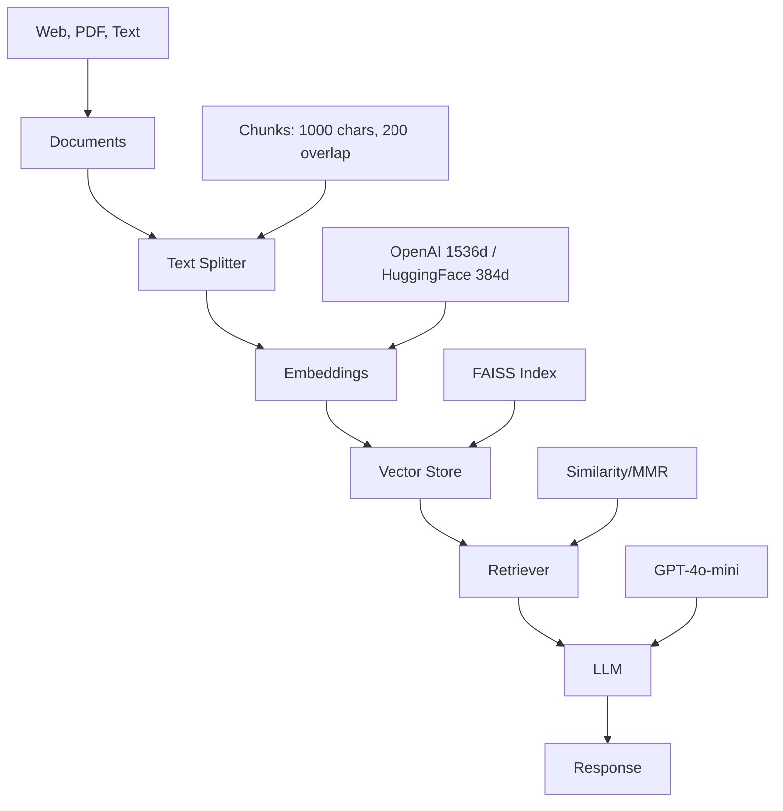

# Architecture

Design decisions and technical architecture of LangChain RAG Tutorial.

## System Overview



## Project Structure

### Modular Design

```text
langchain-rag-tutorial/
|-- shared/                      # Reusable utilities (DRY principle)
|-- notebooks/
|   |-- fundamentals/            # Core concepts (01-03)
|   `-- advanced_architectures/  # Advanced patterns (04-18)
|-- scripts/                     # build_vector_stores.py
|-- templates/                   # FastAPI, Streamlit, Lambda
|-- data/                        # Generated artifacts, Chinook DB (gitignored)
`-- docs/                        # Documentation
```

**Design Rationale:**

- **Modularity**: Each architecture in separate notebook
- **Reusability**: Shared module eliminates code duplication (30+ shared prompts)
- **Persistence**: Vector stores saved to avoid re-embedding
- **Progressive Learning**: Simple -> Advanced complexity gradient

## Architecture Patterns

### 1. Simple RAG (complexity 1/5)

**Pattern**: Query -> Retrieve -> Generate  
**Use Case**: General Q&A, fast responses  
**Complexity**: Minimal

### 2. Memory RAG (complexity 2/5)

**Pattern**: Query + History -> Retrieve -> Generate  
**Use Case**: Chatbots, conversational AI  
**Key Components**: `RunnableWithMessageHistory` with `InMemoryChatMessageHistory` (`langchain_core`)

### 3. Branched RAG (complexity 3/5)

**Pattern**: Query -> Generate Sub-queries -> Parallel Retrieve -> Merge -> Generate  
**Use Case**: Research, comprehensive coverage  
**Key Component**: `MultiQueryRetriever`

### 4. HyDe (complexity 3/5)

**Pattern**: Query -> Generate Hypothetical Answer -> Embed -> Retrieve -> Generate  
**Use Case**: Ambiguous queries, technical jargon  
**Innovation**: Semantic matching via hypothetical documents

### 5. Adaptive RAG (complexity 4/5)

**Pattern**: Query -> Classify Complexity -> Route to Strategy -> Retrieve -> Generate  
**Use Case**: Mixed workloads, cost optimization  
**Routes**: SIMPLE->Similarity, MEDIUM->MMR, COMPLEX->HyDe

### 6. Corrective RAG (complexity 4/5)

**Pattern**: Query -> Retrieve -> Grade Relevance -> [Poor: Web Search] -> Generate  
**Use Case**: High-accuracy domains (legal, medical)  
**Key Component**: Relevance grader + Tavily web search fallback (`langchain_tavily.TavilySearch`)

### 7. Self-RAG (complexity 5/5)

**Pattern**: Query -> Decide Retrieval -> Retrieve -> Generate -> Self-Critique -> [Retry if poor]  
**Use Case**: Quality-critical, exploratory research  
**Innovation**: Autonomous retrieval decision + iterative refinement

### 8. Agentic RAG (complexity 5/5)

**Pattern**: Query -> Agent Loop (Think -> Select Tool -> Execute -> Observe) -> Final Answer
**Use Case**: Complex multi-step reasoning, BI dashboards
**Tools**: Retriever, calculator (`numexpr`), web search (`TavilySearch`)
**Key Component**: ReAct agent pattern

### 9. Contextual RAG (complexity 3/5)

**Pattern**: Documents -> Summarize -> Context-Augment Chunks -> Embed -> Query -> Retrieve -> Generate
**Use Case**: Technical docs, code documentation
**Innovation**: Anthropic's technique - prepend document context to each chunk
**Benefits**: 15-30% better retrieval quality with minimal overhead

### 10. Fusion RAG (complexity 3/5)

**Pattern**: Query -> Generate Multi-Perspectives -> Parallel Retrieve -> RRF Ranking -> Generate
**Use Case**: Research, best ranking quality
**Key Component**: Reciprocal Rank Fusion (RRF) algorithm
**Innovation**: Documents appearing in multiple result sets rank higher

### 11. SQL RAG (complexity 4/5)

**Pattern**: Query -> Retrieve Schema -> Generate SQL -> Validate -> Execute -> Interpret Results
**Use Case**: Analytics, BI, structured data queries
**Key Components**: Schema retrieval, safe SQL execution (read-only, SELECT only)
**Database**: Chinook sample database (music store)

### 12. GraphRAG (complexity 5/5)

**Pattern**: Documents -> Extract Entities -> Extract Relationships -> Build Graph -> Query -> Traverse -> Generate
**Use Case**: Knowledge graphs, relationship queries, multi-hop reasoning
**Key Components**: Entity extraction, NetworkX graph, community detection (Louvain)
**Innovation**: Microsoft Research's approach to graph-based knowledge retrieval

### 13. Multimodal RAG (complexity 4/5)

**Pattern**: Documents + Images -> OCR / Vision Model Description -> Embed -> Retrieve -> Generate
**Use Case**: Documents mixing text with images, diagrams or scanned pages
**Key Components**: Tesseract OCR (`pytesseract`), PDF image extraction (`pdf2image`), vision model (`DEFAULT_VISION_MODEL`)

### Beyond Architectures

- **Comparison** (notebook 11): side-by-side benchmark of the architectures
- **RAGAS evaluation** (notebook 16): faithfulness, relevancy, precision and recall metrics
- **Embedding fine-tuning** (notebook 18): domain-specific sentence-transformers models

## Technology Stack

### Core Dependencies

- **Python**: 3.10-3.13
- **LangChain 1.x**: `langchain`, `langchain-core`, `langchain-openai`, `langchain-text-splitters`,
  `langchain-huggingface`, `langgraph` (all `>=1.0`); `langchain-tavily` (`>=0.2`) for web search
- **langchain-community** (`>=0.4.0,<0.4.2`): FAISS integration and `WebBaseLoader`; see
  [INSTALLATION.md](INSTALLATION.md#why-langchain-community-is-pinned-below-042) for the pin
- **FAISS** (`faiss-cpu`): vector similarity search
- **OpenAI**: GPT-4o-mini (chat), GPT-4o (vision), `text-embedding-3-small`
- **HuggingFace / sentence-transformers**: local embeddings and fine-tuning

### Architecture-Specific Dependencies

- **NetworkX** + **python-louvain**: GraphRAG
- **sqlite3** (standard library) + **pandas**: SQL RAG
- **numexpr**: agent calculator tool
- **RAGAS** + **datasets**: evaluation
- **Matplotlib**: graph visualization
- **pillow**, **pytesseract**, **pdf2image**: multimodal RAG

### Architecture Decisions

#### Why LangChain?

- **LCEL**: Composable chains with `|` operator
- **Integrations**: large ecosystem of model, vector store and loader integrations
- **Active community**: Rapid updates, good docs

#### Why FAISS?

- **Performance**: Facebook AI optimized
- **Local-first**: No external dependencies
- **Persistence**: Save/load vector stores

#### Why GPT-4o-mini?

- **Cost-effective**: $0.15/1M input tokens
- **Fast**: ~1-2s response time
- **Quality**: Good enough for tutorials

#### Why HuggingFace Embeddings?

- **Free**: No API costs
- **Local**: Runs offline after download
- **Decent quality**: 384d embeddings, good for demos

## Design Patterns

### 1. Shared Module Pattern

```python
# Instead of copy-paste in each notebook
from shared import format_docs, load_vector_store, RAG_PROMPT_TEMPLATE
```

**Benefits:**

- DRY principle (Don't Repeat Yourself)
- Single source of truth
- Easy updates (change once, affect all)

### 2. Vector Store Persistence Pattern

```python
from shared.config import OPENAI_EMBEDDING_MODEL, OPENAI_VECTOR_STORE_PATH

embeddings = OpenAIEmbeddings(model=OPENAI_EMBEDDING_MODEL)

# Notebook 02: Create and save
vectorstore = FAISS.from_documents(chunks, embeddings)
save_vector_store(vectorstore, OPENAI_VECTOR_STORE_PATH)

# Notebooks 03-18: Load existing
vectorstore = require_vector_store(OPENAI_VECTOR_STORE_PATH, embeddings)
```

Store paths are keyed by embedding model (`shared/config.py`):

- `OPENAI_VECTOR_STORE_PATH` = `data/vector_stores/openai__<OPENAI_EMBEDDING_MODEL>`
  (default `openai__text-embedding-3-small`)
- `HF_VECTOR_STORE_PATH` = `data/vector_stores/hf__<HF_EMBEDDING_MODEL, with / replaced by __>`
  (default `hf__BAAI__bge-small-en-v1.5`)

Changing the embedding model therefore never loads a stale index. The same stores can be built
outside the notebooks with `make vector-stores` (`scripts/build_vector_stores.py`).

**Benefits:**

- Avoid re-embedding (saves time + API costs)
- Consistent data across notebooks
- Faster iteration

### 3. Progressive Disclosure Pattern

```
00_index.ipynb -> Overview + Navigation
01-03 -> Fundamentals (required)
04-18 -> Advanced (architectures, comparison, evaluation, fine-tuning; pick by use case)
```

**Benefits:**

- Learners not overwhelmed
- Clear prerequisites
- Flexible learning path

## Performance Considerations

Latency, API calls and cost per architecture are documented in [PERFORMANCE.md](PERFORMANCE.md).
The main levers are:

1. **Caching**: persist vector stores and cache responses
2. **Lazy loading**: load embeddings only when needed
3. **Batch processing**: process multiple queries together
4. **Async**: use `ainvoke` / `abatch` for parallel calls

## Security Architecture

### API Key Management

```python
# Correct: environment variables
from dotenv import load_dotenv
import os
load_dotenv()
api_key = os.getenv('OPENAI_API_KEY')

# Wrong: hardcoded
api_key = "sk-proj-..."  # NEVER DO THIS
```

### Gitignore Strategy

```bash
# .gitignore
.env                    # Secrets
vector_stores/          # Generated data
__pycache__/            # Python cache
```

## Extensibility

### Adding New Architecture

1. Create notebook: `notebooks/advanced_architectures/19_new_pattern.ipynb`
2. Add prompts to `shared/prompts.py`
3. Update `11_comparison.ipynb` with new benchmark
4. Document in `notebooks/advanced_architectures/README.md`
5. Update CHANGELOG.md with the addition

### Adding New Utility

1. Add function to `shared/utils.py`
2. Export in `shared/__init__.py`
3. Document in `docs/API_REFERENCE.md`
4. Test in notebooks

## References

**Core RAG:**
- [LangChain Docs](https://docs.langchain.com/)
- [FAISS Documentation](https://faiss.ai/)
- [RAG Paper (Lewis et al.)](https://arxiv.org/abs/2005.11401)

**Advanced Architectures:**
- [Self-RAG Paper](https://arxiv.org/abs/2310.11511)
- [CRAG Paper](https://arxiv.org/abs/2401.15884)
- [LangGraph Documentation](https://docs.langchain.com/oss/python/langgraph/overview)

**Newer Architectures:**
- [Contextual Retrieval (Anthropic)](https://www.anthropic.com/news/contextual-retrieval) - Context-augmented chunking
- [RAG-Fusion Paper](https://arxiv.org/abs/2402.03367) - Reciprocal Rank Fusion
- [GraphRAG (Microsoft Research)](https://www.microsoft.com/en-us/research/blog/graphrag-unlocking-llm-discovery-on-narrative-private-data/)
- [RAGAS Framework](https://docs.ragas.io/) - RAG evaluation metrics
- [Text-to-SQL Survey](https://arxiv.org/abs/2208.13629) - Natural language to SQL
- [NetworkX Documentation](https://networkx.org/) - Graph algorithms

## See Also

- [API_REFERENCE.md](API_REFERENCE.md) - Shared module API
- [PERFORMANCE.md](PERFORMANCE.md) - Benchmarks
- [DEPLOYMENT.md](DEPLOYMENT.md) - Production setup
